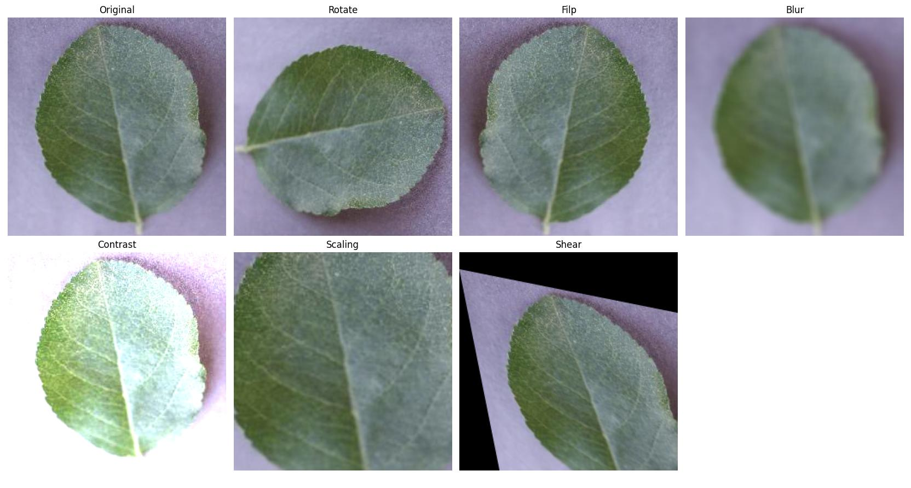
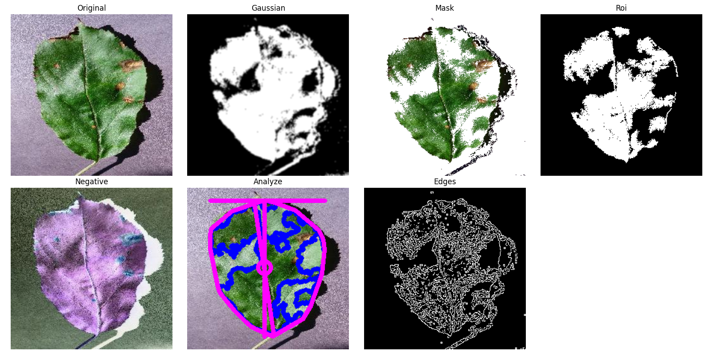
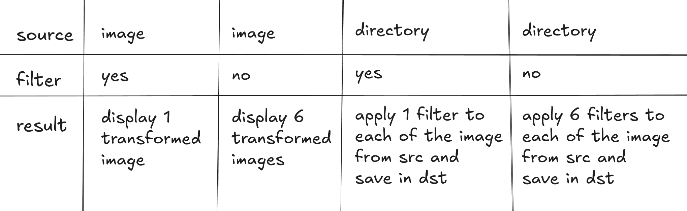

# leaffliction
### 1. Analysis of the Data Set

This program will analyze a plant directory, counts all images in its subfolders, and generates bar and pie charts showing the distribution of classes.
```bash
python3 ./src/Distribution.py "./Apple"
```


--- 
### 2. Image Transformation and Data Augmentation

1. Transform a single image
Displays the original and transformed versions on screen:
```bash
python3 ./src/Augmentation.py "images/leaves/Apple/Apple_healthy/image (1).JPG"
```
**The program will:** 
Generate and display transformed images such as:
- Rotation
- Horizontal flip
- Blur
- Contrast adjustment
- Scaling (zoom)
- Shear transformation


---

2. Process a directory
If the path points to a directory, the tool detects subdirectories (if any) and performs data augmentation for each:
```bash
python3 ./src/Augmentation.py "images/leaves/"
```

**The program will:** 
- Copy original images into augmented_directory/
- Generate additional images if a subdirectory has fewer images than the largest one
- Preserve subdirectory structure

---

## 3. Image Transformation




**There are 4 possible execution ways:** 


---

## 4. Classification

### 4.1. Train

This program allows you to split an image dataset into training/validation sets, train a CNN using TensorFlow, and export the trained model along with the class names inside a .zip file.
```bash
python3 ./src/train.py Grape/
```

The Convolutional Neural Network (CNN) is composed of:
 - Rescaling layer
 - Conv2D layers
 - MaxPooling2D layer
 - Flatten layer
 - Dense layer

Training configuration:
 - Optimizer: Adam
 - Loss: sparse_categorical_crossentropy
 - Metric: accuracy

Once the training is complete, the program saves the model as a .h5 file, save the class names in a .csv file and creates a compressed ZIP file containing both files.

### 4.2. Predict

This program allows you to load a previously trained model (exported as a ZIP file), extract its contents, and classify a single image using the saved CNN.
```bash
python3 ./src/predict.py "Apple/apple_healthy/image (1).JPG" --model apple_model.zip
```

The program will:
Validate the image path.
Extract the model .h5 file and the class names .csv file from the provided ZIP archive.
Load the trained model using TensorFlow/Keras.
Run inference and compute prediction probabilities.

Example output:
```bash
Predicted class: apple_healthy. Confidence 0.97
```
